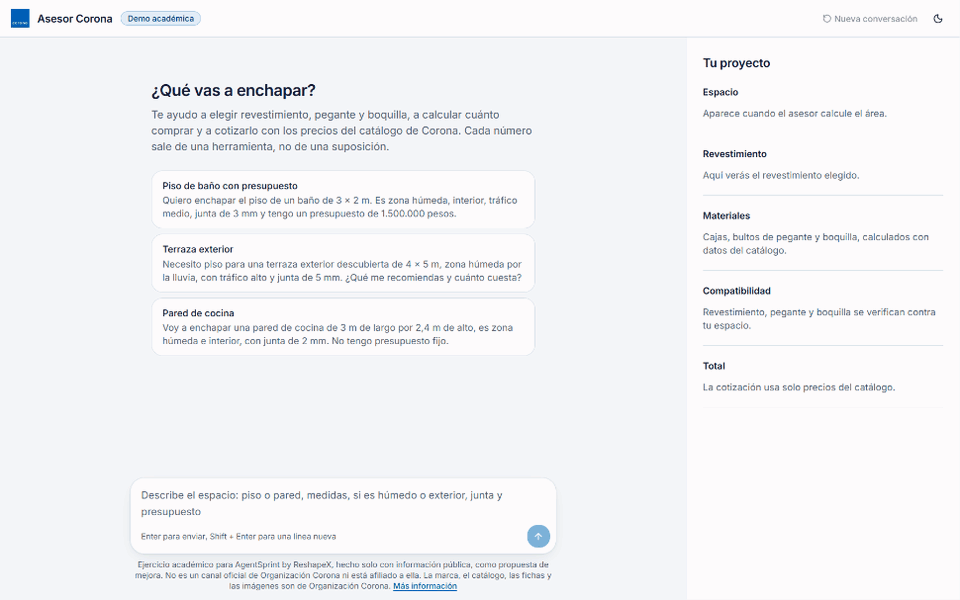
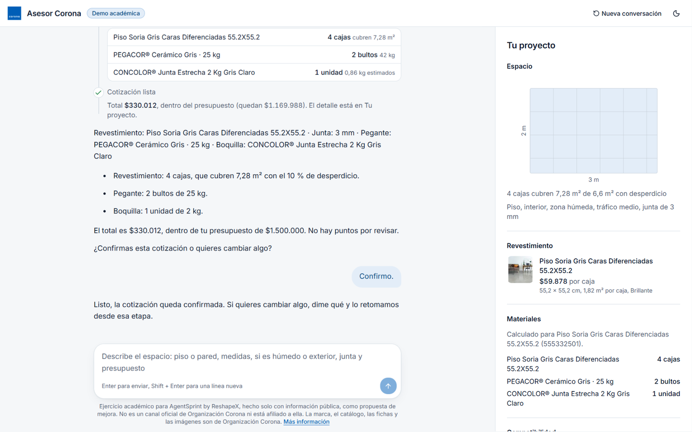
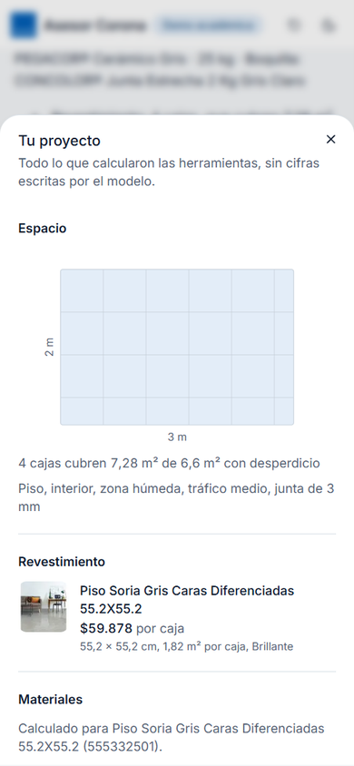
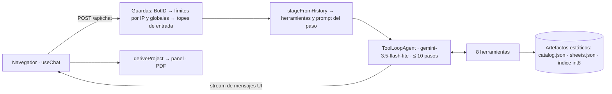

# Corona Asesor

Un agente de IA que planea y cotiza enchapes de pisos y paredes (revestimiento, pegante y boquilla) con el catálogo público de Corona Colombia. **Cada precio, cantidad y afirmación de compatibilidad sale de una herramienta que leyó datos reales o los calculó de forma determinista.**

**Demo en vivo:** https://corona-asesor.vercel.app · **English:** [README.md](README.md)



*Grabado en local con el modelo guionado (`CORONA_SCRIPTED_MODEL=1`): las respuestas son guionadas, pero las herramientas, el catálogo, el panel y el PDF son los reales.*

> **Ejercicio académico.** Se hizo para la competencia AgentSprint by ReshapeX, solo con información pública y sin información privilegiada. Es una propuesta de mejora para un problema real, no un canal oficial de Corona, y no está afiliado a Organización Corona ni cuenta con su respaldo. La marca Corona, su logo, el catálogo, las fichas técnicas y las imágenes de producto pertenecen a Organización Corona.
>
> Si Organización Corona quiere que retire cualquier contenido, [abre un issue](https://github.com/SMarinC/corona-asesor/issues) o contáctame por [mi perfil de GitHub](https://github.com/SMarinC), y lo retiro de inmediato.

## Qué hace

La persona describe su obra, por ejemplo "piso de baño de 3 × 2 m, zona húmeda, junta de 3 mm, presupuesto de 1,5 millones". El agente trabaja como un asesor de tienda, una decisión por turno:
1. Entiende el espacio y pregunta solo lo que falte.
2. Propone dos o tres revestimientos, y el cliente elige uno.
3. Confirma el ancho de junta.
4. Propone un pegante y una boquilla compatibles y revisa las reglas de compatibilidad.
5. Calcula cajas, bultos y unidades y arma una cotización con precios.
6. Pregunta "¿Confirmas esta cotización o quieres cambiar algo?" y cierra.

Cada llamada a una herramienta aparece en vivo como una tarjeta. El panel "Tu proyecto" (plano a escala, materiales, compatibilidad y total), la traza del agente y el PDF salen **solo** de lo que devolvieron las herramientas.

| Escritorio | Celular |
|---|---|
|  |  |

## Garantías de grounding

| Promesa | Quién la hace cumplir |
|---|---|
| Los precios salen solo del catálogo | `buildQuote` solo recibe `{ sku, quantity }` y pone los precios en el servidor |
| Las cantidades salen solo de la calculadora | `computeMaterials` las calcula con los datos del catálogo. `buildQuote` marca cualquier línea que ningún cálculo produjo, y el panel la muestra en ámbar como "Requiere revisión" |
| El modelo no aporta datos de producto | Las herramientas solo reciben los datos del cliente y los SKU. Los 5 productos a los que les falta un dato para calcular una cantidad no se ofrecen (se ofrecen 336 de 341) |
| Ningún paso se puede saltar | Una compuerta de etapas en el servidor solo expone las herramientas del paso actual, y una llamada fuera de paso se rechaza antes de correr |
| Lo desconocido nunca es "incompatible" | Datos de tres estados; lo desconocido es "Requiere revisión" |
| Las citas son reales | Los chips salen de lo que devolvieron las herramientas. Un id que escriba el modelo solo sale verificado si una herramienta lo devolvió (si no, "no verificada"), y cada chip abre el fragmento citado |

## Resultados de las evaluaciones

`npm run evals` corre 8 escenarios por etapas, de varios turnos, contra el modelo real, por el mismo handler y las mismas herramientas de producción. Los escenarios son:
- baño húmedo con presupuesto;
- terraza exterior;
- pared de cocina nombrada por un SKU que termina en punto;
- presupuesto insuficiente;
- precio inventado por el cliente;
- faltan las medidas;
- producto fuera del catálogo;
- "dame solo un estimado".

Todas las revisiones son deterministas: ningún modelo hace de juez. Son completed, steps, entradas de las herramientas, cantidades calculadas, precios del catálogo, montos de las herramientas, asks, review, link y staged (ninguna cotización antes del tercer turno).

Última corrida (2026-10-07, `gemini-3.5-flash-lite`, prompt `2026-10-07.2`):

| Métrica | Resultado |
|---|---|
| Escenarios aprobados | **7/8** |
| Montos en las respuestas que no salieron de una herramienta ni del cliente | 0 |
| Cantidades cotizadas que no salieron de `computeMaterials` | 0 |
| Mediana de pasos por turno | 2 |
| Latencia por turno p95 | 9,8 s |
| Turnos que se quedaron sin tiempo | 0 |
| Herramientas fuera de paso (llamadas que rechazó la compuerta) | 0 |
| Llamadas al modelo | 57 |

**La única falla:** en "faltan las medidas", el primer turno buscó revestimientos antes de tener las medidas. Las pidió, pero también buscó suponiendo un interior en zona húmeda que el cliente nunca dijo.

**Versión del prompt.** El código usa ahora el prompt `2026-10-07.3`. Agrega un ajuste pequeño, hecho después de leer esa corrida: el paso de insumos pide elegir el revestimiento si el cliente aún no lo ha hecho, y la búsqueda de revestimientos ya no toma el presupuesto total como precio por caja. Todavía no se ha corrido contra el modelo real.

Reporte completo: [evals/report.md](evals/report.md).

## Arquitectura



- **Asesor por etapas:** cada petición deduce la etapa de la compra a partir del historial y le da al agente solo las herramientas de ese paso y un prompt para ese paso ([ADR-003](docs/adr/003-tools-and-citation-verification.md)).
- **Sin estado en el servidor:** el navegador guarda la conversación, y el servidor vuelve a revisar las cotizaciones contra el historial que recibe ([ADR-002](docs/adr/002-stateless-serverless.md)).
- **Citas estáticas:** los 912 fragmentos citables están prerenderizados, así que abrir uno nunca ejecuta una función.
- **Una línea de log estructurada `chat_turn` por turno:** pasos, herramientas, latencias, tokens y resultado.
- **Carga inicial ligera:** el JS de la página de inicio pesa unos 355 KB gzip. El renderizador de markdown y la librería del PDF cargan cuando hacen falta.

## Datos

El catálogo (341 SKU comprables: 298 revestimientos, 12 pegantes y 31 boquillas) y 912 fragmentos de fichas técnicas son una **copia preprocesada de un scraping del catálogo público de Corona**, hecha para la competencia e indexada una vez con `gemini-embedding-2`.
- **Se congeló a propósito, por simplicidad.** Se podría escribir un script que siga trayendo los productos nuevos, pero el objetivo de este proyecto es mostrar el **comportamiento del agente**, no la ingesta. Los precios pueden diferir de los actuales ([ADR-001](docs/adr/001-static-data-snapshot.md)).
- **Los datos son de la empresa, nunca del modelo.** Cuando la propia ficha de un revestimiento dice sus m² por caja, el pipeline los completa (2 revestimientos). Los 5 productos a los que aún les falta un dato para calcular una cantidad (2 revestimientos, 1 pegante y 2 boquillas) no se ofrecen.

## Límites y protección

- **BotID:** rechaza las peticiones que no traen el desafío del navegador, así que **un `curl` a `/api/chat` en producción responde `403 bot_detected`**. Usa la interfaz.
- **Por IP:** 15 peticiones cada 10 minutos y 60 al día.
- **Globales:** 12 llamadas al modelo por minuto y 200 al día. El free tier permite 15 por minuto y 500 al día.
- **Entrada:** mensajes de hasta 1.000 caracteres; historial de hasta 20 mensajes y 64 KB.
- **Turnos:** hasta 10 pasos y 50 s por turno.
- **Si fallan BotID o Upstash, el turno sigue y queda registrado** ([ADR-006](docs/adr/006-abuse-protection-and-quota.md)).

## Correrlo en local

Necesitas Node ≥ 22.

```bash
git clone https://github.com/SMarinC/corona-asesor && cd corona-asesor
npm ci
cp .env.example .env.local

# Sin key: reproduce una cotización de baño guionada con las herramientas y el catálogo reales (sin gastar cuota)
CORONA_SCRIPTED_MODEL=1 npm run dev          # PowerShell: $env:CORONA_SCRIPTED_MODEL=1; npm run dev

# Con una key gratuita de Google AI Studio en .env.local (GOOGLE_GENERATIVE_AI_API_KEY)
npm run dev

npm test                       # 556 tests, sin red
npm run evals -- --scripted    # el harness de evaluaciones con el modelo guionado, sin cuota
npm run evals                  # modelo real: unas 60 llamadas del free tier (57 en la última corrida, con tope de 110)
```

## Créditos

El prototipo original lo hizo un equipo (Daniel Garzón, Juan Miranda y Santiago Marín) para AgentSprint by ReshapeX. Esta versión es una reescritura de Santiago Marín: arquitectura en TypeScript, agente y herramientas, protecciones, interfaz con streaming, evaluaciones de grounding y despliegue en Vercel.

## Licencia

MIT para el código fuente de esta reescritura. El nombre, el logo, la marca, los datos del catálogo, los precios, las fichas técnicas y las fotos de producto de Corona pertenecen a Organización Corona y no se licencian, como tampoco el prototipo original del equipo que queda en el historial de git ([LICENSE](LICENSE)).
