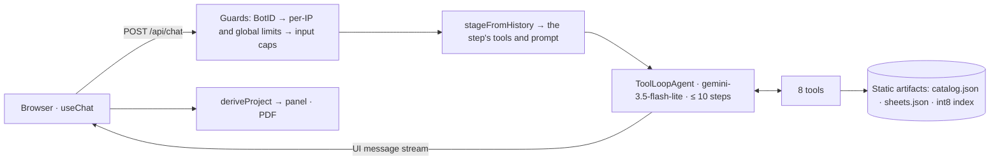

# Corona Asesor

An AI agent that plans and quotes floor and wall tiling (tiles, adhesive and grout) from the public Corona Colombia catalog. **Every price, quantity and compatibility claim comes from a tool that read real data or computed it deterministically.**

**Live demo:** https://corona-asesor.vercel.app · **Español:** [README.es.md](README.es.md)


*Recorded locally with the scripted model (`CORONA_SCRIPTED_MODEL=1`): the replies are scripted, while the tools, the catalog, the panel and the PDF are the real ones.*

> **Academic exercise.** This project was built for the AgentSprint by ReshapeX competition, using only publicly available information and no privileged data. It is an improvement proposal for a real problem, not an official Corona channel. It is not affiliated with or endorsed by Organización Corona. The Corona brand, logo, catalog, technical sheets and product images belong to Organización Corona.
>
> If Organización Corona would like any content removed, [open an issue](https://github.com/SMarinC/corona-asesor/issues) or contact me through [my GitHub profile](https://github.com/SMarinC), and I will remove it right away.

## What it does

A visitor describes a job, for example "3 × 2 m bathroom floor, wet area, 3 mm joint, budget 1.5 M COP". The agent then works like a store advisor, one decision per turn:
1. It understands the space and asks only for what is missing.
2. It proposes two or three tiles, and the customer chooses one.
3. It confirms the joint width.
4. It proposes a compatible adhesive and grout and checks the compatibility rules.
5. It computes boxes, bags and units and builds a priced quote.
6. It asks "¿Confirmas esta cotización o quieres cambiar algo?" and closes.

Every tool call streams as a card. The "Tu proyecto" panel (floor plan to scale, materials, compatibility, total), the agent trace and the downloadable PDF are derived **only** from tool outputs. The agent and the UI speak Spanish.

| Desktop | Phone |
|---|---|
|  |  |

## Grounding guarantees

| Claim | Enforced by |
|---|---|
| Prices only come from the catalog | `buildQuote` accepts `{ sku, quantity }` only and prices every line server-side |
| Quantities only come from the calculator | `computeMaterials` computes them from catalog values. `buildQuote` flags any line no calculation produced, and the panel shows it in amber as "Requiere revisión" |
| The model supplies no product data | Tools take only the customer's facts and SKUs. The 5 products missing a value needed for a quantity are not offered (336 of 341 are) |
| Steps cannot be skipped | A server-side stage gate exposes only the current step's tools, and an out-of-step call is rejected before it runs |
| Unknown is never "incompatible" | Tri-state product data; unknown means "Requiere revisión" |
| Citations are real | Chips come from tool outputs. An id the model writes is verified only if a tool returned it ("no verificada" otherwise), and every chip opens the cited fragment |

## Eval results

`npm run evals` runs 8 staged, multi-turn scenarios against the real model, through the real route handler and tools. The scenarios are: a wet bathroom with a budget, an outdoor terrace, a kitchen wall named by a SKU with a trailing period, a budget that is too low, a fake price from the customer, missing dimensions, an out-of-catalog product, and "just give me an estimate".

Every check is deterministic: there is no model-as-judge. The checks are completed, steps, tool inputs, quantities computed, catalog prices, money from tools, asks, review, link and staged (no quote before the third turn).

Latest run (2026-10-07, `gemini-3.5-flash-lite`, prompt `2026-10-07.2`):

| Metric | Result |
|---|---|
| Scenarios passed | **7/8** |
| Money in answers not from a tool or the customer | 0 |
| Quote quantities not from `computeMaterials` | 0 |
| Median steps per turn | 2 |
| Turn latency p95 | 9.8 s |
| Timeouts | 0 |
| Calls the stage gate rejected ("herramientas fuera de paso") | 0 |
| Model calls spent | 57 |

**The one failure:** in missing-dimensions, the first turn searched tiles before it had the measurements. It asked for them, but also searched with an indoor wet area the customer never stated.

**Prompt version.** The code now runs prompt `2026-10-07.3`. It adds one small fix made after reading that run: the supplies step asks for the tile choice when the customer has not made one, and the tile search no longer takes the total budget as a price per box. It has not been run against the real model yet.

Full report: [evals/report.md](evals/report.md).

## Architecture



- **Staged advisor:** each request derives the purchase stage from the history and gives the agent only that step's tools and a prompt for that step ([ADR-003](docs/adr/003-tools-and-citation-verification.md)).
- **Stateless:** the browser holds the conversation, and the server re-checks quotes against the history it receives ([ADR-002](docs/adr/002-stateless-serverless.md)).
- **Static citations:** the 912 citation fragments are prerendered, so opening one never runs a function.
- **One structured `chat_turn` log line per turn:** steps, tools, latencies, tokens, outcome.
- **Fast first load:** first-load JS on the home page is about 355 KB gzip. The markdown renderer and the PDF library load on demand.

| Tool | What it is for |
|---|---|
| `searchTiles` | Filters the catalog by surface, environment, wet area, design, color and price per box, flagging unknown attributes |
| `searchSupplies` | Adhesives by tile material and outdoor use; grouts by joint width and color |
| `getProduct` | The full normalized product |
| `searchTechnicalSheets` | Semantic search over the sheets (keyword fallback), returning `citationId`s |
| `computeMaterials` | Area plus waste, boxes, adhesive kg and bags, grout kg and units, all from catalog values |
| `checkCompatibility` | Rules for surface, environment, humidity, traffic, adhesive and grout |
| `buildQuote` | Catalog prices, total, budget verdict; flags quantities that were not computed |
| `getCompanyInfo` | Company facts and links for categories outside the catalog |

## Data

The catalog (341 purchasable SKUs: 298 tiles, 12 adhesives, 31 grouts) and 912 technical-sheet fragments are a **preprocessed snapshot of a scrape of Corona's public catalog**, made for the competition and embedded once with `gemini-embedding-2`.
- **Frozen on purpose, for simplicity.** A script that keeps pulling new products is feasible, but this project exists to show **agent behavior**, not ingestion. Prices may differ from current ones ([ADR-001](docs/adr/001-static-data-snapshot.md)).
- **The data is the company's, never the model's.** Where a tile's own sheet states its m² per box, the pipeline fills it in (2 tiles). The 5 products still missing a value needed to size a quantity (2 tiles, 1 adhesive, 2 grouts) are not offered.

## Limits and abuse protection

- **BotID:** requests without the browser challenge are rejected, so **`curl` against the production `/api/chat` returns `403 bot_detected`**. Use the UI.
- **Per IP:** 15 requests per 10 minutes and 60 per day.
- **Global:** 12 model calls per minute and 200 per day. The free tier allows 15 RPM and 500 RPD.
- **Inputs:** messages of at most 1,000 characters; history of at most 20 messages and 64 KB.
- **Turns:** at most 10 steps and 50 s per turn.
- **Fail open:** if BotID or Upstash is unavailable, the turn proceeds and the failure is logged ([ADR-006](docs/adr/006-abuse-protection-and-quota.md)).

## Run it locally

Node ≥ 22.

```bash
git clone https://github.com/SMarinC/corona-asesor && cd corona-asesor
npm ci
cp .env.example .env.local

# No key needed: replay a scripted bathroom quote through the real tools and catalog (no quota)
CORONA_SCRIPTED_MODEL=1 npm run dev          # PowerShell: $env:CORONA_SCRIPTED_MODEL=1; npm run dev

# With a free Google AI Studio key in .env.local (GOOGLE_GENERATIVE_AI_API_KEY)
npm run dev

npm test                       # 556 tests, no network
npm run evals -- --scripted    # the eval harness with the scripted model, no quota
npm run evals                  # real model: about 60 free-tier calls (57 in the latest run, capped at 110)
```

## Repository map

| Path | Contents |
|---|---|
| `lib/domain` | Pure rules: calculations, compatibility, citations, quote, quantity checks |
| `lib/data` | Artifact loaders and vector search |
| `lib/agent` | Staged prompt, stage gate, agent, the 8 tools |
| `lib/guard`, `lib/chat` | Guards and the chat handler |
| `lib/ui`, `components` | `deriveProject`, cards, panel, trace, PDF |
| `evals` | Scenarios, harness, scoring, latest report |
| `scripts` | The offline data pipeline |
| `docs/adr` | Decision records 001–006 |

## Credits

The original prototype was built by a team (Daniel Garzón, Juan Miranda and Santiago Marín) for AgentSprint by ReshapeX. This version is a rewrite by Santiago Marín: TypeScript architecture, agent and tools, guards, streaming UI, grounding evals and the Vercel deployment.

## License

MIT for the source code of this rewrite. Corona's name, logo, brand, catalog data, prices, technical sheets and product photos belong to Organización Corona and are not licensed, and neither is the original team prototype in the git history ([LICENSE](LICENSE)).
